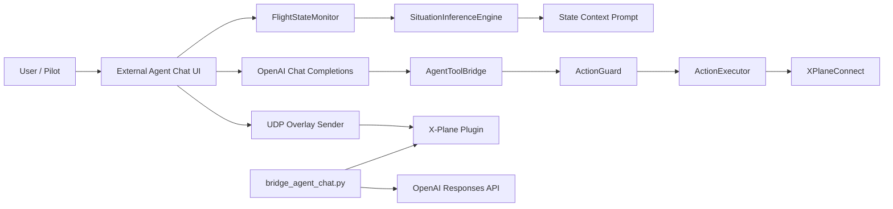

# X-Plane 11 Co-Pilot

本仓库实现了一个面向 X-Plane 11 的 Co-Pilot 系统，核心目标是：
- 持续感知飞行状态
- 自动推断飞行阶段与风险
- 允许 LLM 在 Guard 保护下调用受控动作
- 将简短态势摘要通过 UDP 发送到 X-Plane 插件

当前主链路是 `external_agent_chat_ui.py`。它把聊天 UI、状态监控、态势推断、LLM tool calling、Guard、Executor 串成一条完整闭环。

## 目录结构

```text
agent_core/                    核心域模型、状态监控、态势推断、Guard/Executor
code_test/                     单元测试
docs/                          架构说明
xplane_agent_chat_plugin/      X-Plane 插件与独立 UDP bridge
external_agent_chat_ui.py      主入口：外部聊天 UI + tool calling + 受控执行
requirements.txt               Python 依赖
```

## 推荐入口

### 1. 主产品链路

```powershell
python external_agent_chat_ui.py
```

这个入口会启动：
- Tkinter 聊天界面
- X-Plane 状态采样
- 飞行阶段/风险推断
- OpenAI Chat Completions tool calling
- Guard 保护下的动作执行
- 向插件发送 `AGENT|...` overlay

### 2. 插件聊天桥

```powershell
cd xplane_agent_chat_plugin
python bridge_agent_chat.py --model gpt-4o-mini
```

这是一个独立的 UDP 聊天桥，负责接收插件发来的 `PILOT|...`，调用 LLM，再回传 `AGENT|...`。它和主产品链路是并行存在的，不是同一条执行链。

## Agent 架构



### 分层职责

#### 1. 感知层

`agent_core/copilot_state_monitor.py`
- 通过 XPlaneConnect 持续读取 X-Plane 状态
- 默认采样频率为 2Hz
- 维护最近 30 秒快照窗口
- 对外提供 `get_latest()`、`get_window()`、`get_last_error()`

#### 2. 态势层

`agent_core/copilot_situation.py`
- 基于最新快照和 10s / 30s 窗口进行阶段推断
- 当前阶段包含：
  - `ground_hold`
  - `takeoff_roll`
  - `initial_climb`
  - `cruise`
  - `approach`
  - `landing_roll`
- 当前风险包含：
  - `stall_risk`
  - `overspeed_risk`
  - `throttle_ineffective`
  - `unstable_approach`
  - `runway_excursion_risk`
- 输出统一的 `SituationReport`

#### 3. 决策层

`external_agent_chat_ui.py`
- 将 `SituationReport` 组装为 `state_context`
- 把 `state_context` 注入系统提示词
- 要求模型先读状态，再在需要时调用工具
- 最终输出固定为 JSON：
  - `reply`
  - `overlay`

#### 4. 工具层

`AgentToolBridge`
- 暴露给模型的当前工具：
  - `get_flight_state`
  - `set_throttle`
  - `set_flaps`
  - `set_gear`
  - `release_brakes`
- 其中写操作会走 `ActionPlan -> Guard -> Executor`
- 注意：核心域里已有 `SET_PITCH_CMD`，但当前 UI 工具集没有开放这个工具

#### 5. 安全层

`agent_core/copilot_guard_executor.py`
- `ActionGuard` 负责参数范围和场景约束校验
- 例如：
  - 起落架在高速地面状态下不能收起
  - 高速时会阻止刹车释放类动作
- `ActionExecutor` 只执行已通过 Guard 的动作
- 执行通过 XPlaneConnect 映射到 `sendCTRL()` / `sendDREFs()`

#### 6. 输出层

`external_agent_chat_ui.py`
- UI 内展示详细回答
- 通过 UDP 向插件发送短摘要 overlay
- 状态灯展示 XPC / Plugin / LLM 的健康状态

## 运行前置条件

- 已安装 X-Plane 11
- 已安装并启用 NASA XPlaneConnect 插件
- Python 3.10+
- `.env` 中至少设置：
  - `OPENAI_API_KEY=...`
  - 可选 `OPENAI_BASE_URL=...`

## 安装依赖

```powershell
.\venv\Scripts\Activate.ps1
pip install -r requirements.txt
```

## 运行方式

### 主链路

```powershell
python external_agent_chat_ui.py
```

### 插件桥

```powershell
cd xplane_agent_chat_plugin
python bridge_agent_chat.py --model gpt-4o-mini
```

## 测试

```powershell
python -m unittest -v `
  code_test/test_external_agent_chat_ui.py `
  code_test/test_agent_tool_bridge.py `
  code_test/test_copilot_situation.py `
  code_test/test_xpc_text_encoding.py `
  xplane_agent_chat_plugin/test_bridge_agent_chat.py
```

## 关键设计点

- 读写分离：模型先看 `SituationReport`，再决定是否调用动作工具
- 安全优先：所有写操作先过 Guard
- 可追溯：态势推断和工具执行都返回结构化结果
- 兼容性：UI 的 JSON 输出失败时会回退到纯文本，避免聊天中断

## 已知边界

- 当前主链路是“外部 UI + tool calling”，不是自动驾驶
- `ActionExecutor` 只覆盖当前已实现的动作类型
- 插件聊天桥是独立路径，不参与主链路的 Guard/Executor 执行

## 后续建议

1. 如果你希望，我可以继续把 `docs/AGENT_ARCHITECTURE.md` 一并整理成正常中文编码版本。
2. 如果你希望，我也可以把 README 再补一版“快速开始 + 故障排查”章节。
