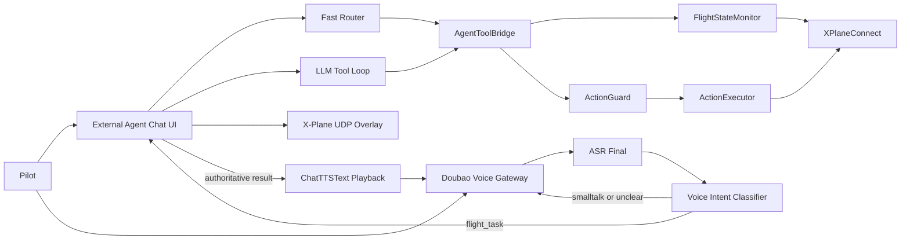

# X-Plane 11 Co-Pilot

本项目是面向 X-Plane 11 的副驾驶 Agent 系统。当前设计的核心原则是：**后台 X-Plane agent 是唯一权威事实源和工具执行源，语音模型只做前台听说、寒暄与澄清。**

## 核心架构



## 核心代码清单

这些文件构成当前主链路，后续维护应优先阅读它们：

```text
external_agent_chat_ui.py          主入口：UI、快慢路径、语音调度、工具编排
agent_core/agent_tools.py          AgentToolBridge 与 FastCommandRouter
agent_core/copilot_core.py         动作、状态、控制计划等核心数据结构
agent_core/copilot_state_monitor.py X-Plane 状态采样
agent_core/copilot_situation.py    飞行阶段与风险推断
agent_core/copilot_guard_executor.py 控制前 Guard 与执行器
agent_core/background_tools.py     闭环目标工具后台任务
agent_core/proactive_watchdog.py   主动风险监测
voice_agent/session.py             Realtime 语音 provider 与豆包二进制协议
voice_agent/orchestrator.py        语音 turn-state 状态机
voice_agent/events.py              语音事件类型
voice_agent/config.py              语音配置
xplane_agent_chat_plugin/          X-Plane 插件与 UDP 桥接
```

## 已弃用但保留的代码

这些文件主要用于早期开发、手工排查或历史实验，不属于当前推荐运行路径。已在文件头部标注“已弃用”。

```text
voice_agent/doubao_e2e_smoke.py    早期豆包端到端手工烟测脚本
voice_agent/mic_probe.py           本地麦克风设备手工探针
voice_agent/local_stt_probe.py     本地 Whisper/STT 手工探针
```

说明：`voice_agent/tests/` 和 `code_test/` 是自动化测试，不属于弃用代码。

## 文本链路

1. 用户输入文本。
2. `FastCommandRouter` 优先处理低风险、低延迟任务，例如状态查询、目标航向/俯仰、部分控制动作。
3. 快路径未命中或需要复杂推理时，进入 LLM tool-calling 慢路径。
4. 所有状态读取和控制执行都通过 `AgentToolBridge`。
5. 控制动作必须先经过 `ActionGuard`，再由 `ActionExecutor` 写入 X-Plane。

## 语音链路

豆包语音模型被定义为 **Voice Gateway**，不是飞行事实源。

1. 豆包实时接口负责 ASR/TTS。
2. `451 ASRResponse.results[].text` 作为 pilot ASR final。
3. ASR final 进入 `VoiceIntentDecision` 分类：
   - `flight_task`：状态、风险、导航、控制、工具调用，必须进入后台 agent。
   - `smalltalk`：寒暄、身份介绍等，可以临时放开豆包自然回答。
   - `unclear`：不完整或听不清，可以临时放开豆包追问澄清。
4. `flight_task` 会关闭豆包自由业务播报，只播放后台权威结果。
5. 后台结果通过豆包 `500 ChatTTSText` 回灌播报。
6. UI 中三类消息分开显示：
   - `Pilot [voice]`：用户语音识别文本
   - `Backend`：后台权威结果，包含真实状态或工具执行结果
   - `Voice`：实际播报给飞行员的文本

## ASR Final 分类策略

分类策略是“规则优先，LLM 兜底”：

- 规则层本地执行，默认偏安全：
  - 飞行状态、控制、风险关键词 -> `flight_task`
  - 明确寒暄 -> `smalltalk`
  - 太短或不完整 -> `unclear`
- 可选 LLM 兜底：
  - `VOICE_INTENT_LLM_FALLBACK=true`
  - 仅当规则置信度低于 `VOICE_INTENT_LLM_THRESHOLD` 时调用
  - 输出严格 JSON：`intent/confidence/reason`
- 安全默认：只要像飞行任务，宁可归入 `flight_task`。

## 快慢双系统

- 快系统：规则驱动，优先处理状态查询和低风险动作。
- 慢系统：LLM tool-calling，用于复杂意图、风险场景和多步工具推理。
- 目标类闭环工具支持异步后台执行：
  - `set_target_pitch_deg`
  - `turn_to_heading`

相对转向由规则确定性解析，例如“向左偏转 15 度”会基于当前航向计算目标航向，避免模型把相对角误写成错误绝对航向。

## 配置

### Fast Path

文件：`fast_path_policy.json`

- `state_query_keywords`：状态查询关键词
- `action_policies`：动作执行模式，`direct` 或 `llm`
- `max_abs_target_pitch_deg_fast`：快系统允许的最大目标俯仰
- `max_heading_delta_deg_fast`：快系统允许的最大航向改变量
- `blocked_phases_for_fast_control`：禁止快执行的阶段
- `blocked_risks_for_fast_control`：禁止快执行的风险

### Control Axis

文件：`control_axis_config.json`

```json
{
  "roll_cmd_sign": 1.0,
  "pitch_cmd_sign": 1.0,
  "rudder_cmd_sign": 1.0
}
```

XPC `sendCTRL` 槽位顺序是 `[pitch, roll, yaw, throttle, gear, flaps, speedbrake]`。

### Voice

常用环境变量：

```powershell
$env:VOICE_ENABLED="true"
$env:VOICE_MODE="hybrid"
$env:VOICE_PROVIDERS="volcengine,mock"
$env:VOICE_INTENT_LLM_FALLBACK="false"
$env:VOICE_INTENT_LLM_THRESHOLD="0.55"
$env:DOUBAO_INPUT_MOD="keep_alive"
$env:DOUBAO_END_SMOOTH_MS="1500"
$env:DOUBAO_ENABLE_CUSTOM_VAD="false"
$env:VOICE_VAD_SILENCE_MS="450"
$env:VOLCENGINE_TTS_SPEAKER="zh_female_vv_jupiter_bigtts"
```

## 运行

```powershell
.\venv\Scripts\Activate.ps1
pip install -r requirements.txt
python external_agent_chat_ui.py
```

启用语音：

```powershell
$env:VOICE_ENABLED="true"
python external_agent_chat_ui.py
```

## 测试

核心回归：

```powershell
python -m unittest voice_agent.tests.test_volcengine_protocol voice_agent.tests.test_session code_test.test_external_agent_chat_ui
```

更完整回归：

```powershell
python -m unittest -v `
  code_test.test_external_agent_chat_ui `
  code_test.test_agent_tool_bridge `
  code_test.test_action_executor_mapping `
  code_test.test_proactive_watchdog `
  code_test.test_copilot_situation `
  xplane_agent_chat_plugin.test_bridge_agent_chat
```

## 维护约定

- 不让 UI 或语音层直接读写 X-Plane。
- 不让豆包自由生成飞行状态、控制结果或风险判断。
- `Backend` 文本用于审计，`Voice` 文本用于回看实际播报。
- 新增控制类能力时，先补 Guard，再接工具，再接 UI/语音。
- 历史探针脚本可以保留，但必须标注“已弃用”，避免被误认为主链路。
