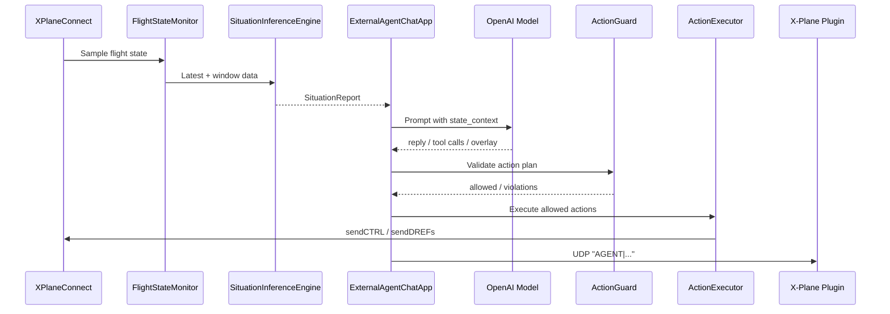

# X-Plane Co-Pilot Agent 架构说明

## 1. 目标

这个系统的目标是把 Agent 从“只会聊天”升级为“能理解飞行态势、能给出有依据的建议、能在安全约束下执行动作”。

核心原则：
- 分层解耦：感知、态势理解、决策、执行各自独立
- 安全优先：所有写操作必须先经过 Guard
- 可追溯：每条建议都应当能回溯到 `evidence`

## 2. 总体结构

```text
agent_core/
  __init__.py
  copilot_core.py              # 核心数据结构与动作/结果模型
  copilot_state_monitor.py     # XPC 持续采样与滑动窗口缓存
  copilot_situation.py         # 飞行阶段推断与风险识别
  copilot_guard_executor.py    # 动作白名单校验与执行器

code_test/
  test_external_agent_chat_ui.py
  test_copilot_situation.py
  test_xpc_text_encoding.py
  test_agent_tool_bridge.py

docs/
  AGENT_ARCHITECTURE.md

external_agent_chat_ui.py      # 外部聊天 UI + state_context + tool calling
xplane_agent_chat_plugin/      # 插件侧聊天桥与 UDP 通信
```

## 3. 模块职责

### 3.1 `agent_core/copilot_core.py`

定义系统通用数据结构：
- `FlightSnapshot`
- `TrendMetrics`
- `SituationReport`
- `Action`
- `ActionPlan`
- `GuardResult`
- `ExecResult`
- `ControlMode`
- `ActionType`

这一层不包含业务流程，只负责统一数据契约。

### 3.2 `agent_core/copilot_state_monitor.py`

职责：
- 通过 XPlaneConnect 持续读取 X-Plane 状态
- 默认采样频率为 `2Hz`
- 保留最近 `30` 秒窗口
- 对外提供：
  - `get_latest()`
  - `get_window(seconds)`
  - `get_last_error()`

这一层是系统的“感知输入”。

### 3.3 `agent_core/copilot_situation.py`

职责：
- 根据最新快照和时间窗计算趋势
- 推断当前飞行阶段
- 识别风险项
- 输出统一的 `SituationReport`

当前阶段包括：
- `ground_hold`
- `takeoff_roll`
- `initial_climb`
- `cruise`
- `approach`
- `landing_roll`

当前风险包括：
- `stall_risk`
- `overspeed_risk`
- `throttle_ineffective`
- `unstable_approach`
- `runway_excursion_risk`

这一层是系统的“态势理解”。

### 3.4 `agent_core/copilot_guard_executor.py`

职责：
- `ActionGuard` 负责动作范围校验和场景约束
- `ActionExecutor` 负责把已通过校验的动作映射到 X-Plane 控制接口

当前支持的动作：
- `SET_THROTTLE`
- `SET_PITCH_CMD`
- `SET_GEAR`
- `SET_FLAPS`
- `RELEASE_BRAKES`

这一层是系统的“安全执行边界”。

### 3.5 `external_agent_chat_ui.py`

职责：
- 提供外部聊天 UI
- 读取 `SituationReport` 并组装 `state_context`
- 将 `state_context` 注入 LLM prompt
- 通过 tool calling 调用 `AgentToolBridge`
- 将 `overlay` 发送到 X-Plane 插件

这是一条完整的主业务链路。

### 3.6 `xplane_agent_chat_plugin/bridge_agent_chat.py`

职责：
- 接收插件发来的 UDP 消息
- 调用 LLM 生成简短回复
- 再把回复发回插件

这是一条独立的聊天桥，不参与主链路的 Guard/Executor。

## 4. 数据流



## 5. 为什么这样设计

- 态势先行：Agent 不是直接猜测，而是先构造 `SituationReport`
- 工具受控：所有写动作都必须经过 Guard
- 便于测试：每层都能单独做单元测试
- 易于扩展：后续可以继续加新的动作、风险规则和阶段规则

## 6. 当前局限

- 主链路不是自动驾驶，只是辅助决策与受控动作执行
- 当前 UI 暴露的工具有限，未开放所有 `ActionType`
- 态势识别是规则型近似，不是学习型分类器

## 7. 后续演进建议

1. 为 `SituationInferenceEngine` 增加 hysteresis，降低阶段抖动
2. 给 Guard 增加更细的场景约束和机型参数配置
3. 统一主链路和插件桥的消息协议
4. 为更多动作补齐测试
