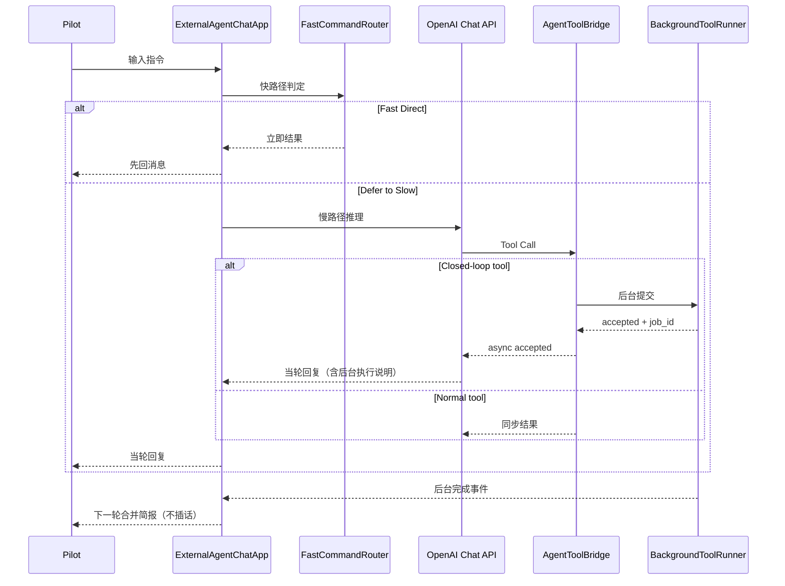

# X-Plane Co-Pilot Agent 架构说明

## 1. 目标

系统目标是让 Agent 具备“感知 -> 判断 -> 执行 -> 反馈”的完整闭环：
- 实时感知飞行状态
- 推断飞行阶段与风险
- 在安全约束下执行动作
- 通过 UI 与 X-Plane 插件对用户反馈

## 2. 分层架构

```text
UI/Orchestrator
  external_agent_chat_ui.py

Domain Core
  agent_core/copilot_core.py
  agent_core/copilot_state_monitor.py
  agent_core/copilot_situation.py
  agent_core/copilot_guard_executor.py
  agent_core/agent_tools.py
  agent_core/proactive_watchdog.py
  agent_core/background_tools.py

Config
  fast_path_policy.json
  control_axis_config.json

Tests
  code_test/*.py
```

## 3. 关键模块

### 3.1 FlightStateMonitor

- 基于 XPlaneConnect 持续采样飞行数据
- 维护滑动窗口（10s/30s）
- 输出最新快照和历史窗口

### 3.2 SituationInferenceEngine

- 从快照 + 窗口特征推断飞行阶段
- 识别风险：`stall_risk`、`overspeed_risk`、`unstable_approach` 等
- 输出结构化 `SituationReport`

### 3.3 ActionGuard + ActionExecutor

- Guard：动作参数范围与场景限制校验
- Executor：将动作映射到 XPC 控制接口
- 控制指令统一经过 Guard，避免直接绕过安全约束

XPC `sendCTRL` 顺序：
- `[pitch, roll, yaw, throttle, gear, flaps, speedbrake]`

### 3.4 AgentToolBridge

- 提供 LLM 可调用工具
- 支持原子动作与闭环目标动作
- 支持闭环工具异步后台执行（`execute_async`）

### 3.5 FastCommandRouter（快系统）

- 规则识别常见指令并快速响应
- 通过策略文件控制“直执/回慢系统”
- 对目标动作执行门禁：幅度、阶段、风险

### 3.6 ProactiveWatchdog

- 持续监测风险状态
- 防抖 + 冷却
- 触发主动告警事件给慢系统处理

### 3.7 BackgroundToolRunner

- 后台执行耗时闭环工具
- 维护任务状态与结果
- 完成后由 UI 汇总，不打断当前对话

## 4. 快慢系统协作



## 5. 数据流与安全边界

1. 监测层产生状态数据。
2. 态势层输出阶段/风险语义。
3. 快系统决定是否可立即执行。
4. 慢系统在需要时调用工具。
5. 所有写动作统一经过 Guard。
6. Executor 执行后回传结构化结果。
7. UI 将关键信息通过聊天和 overlay 输出。

## 6. 当前实现特性

- 中文默认回复
- 工具调用结果结构化返回
- 快系统输出精简关键参数
- 支持主动告警与自动缓解
- 支持后台闭环工具执行与下一轮简报合并

## 7. 测试覆盖

重点测试文件：
- `code_test/test_external_agent_chat_ui.py`
- `code_test/test_agent_tool_bridge.py`
- `code_test/test_action_executor_mapping.py`
- `code_test/test_proactive_watchdog.py`
- `code_test/test_copilot_situation.py`
