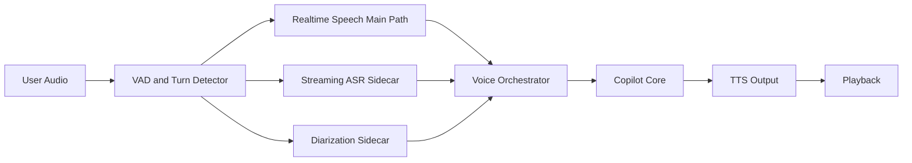

# Voice Agent Architecture

## Event Flow

## State Machine

States:
- `idle`
- `user_turn`
- `agent_thinking`
- `agent_speaking`
- `interrupted`

Core events:
- `user_speaking`
- `turn_end`
- `barge_in`
- `agent_thinking`
- `agent_speaking`
- `silence_timeout`
- `speaker_switch`
- `asr_partial`
- `asr_final`

## Integration Contract
- `VoiceOrchestrator.transition(event_type, payload)`：统一写入事件
- `VoiceOrchestrator.snapshot()`：提供 UI/日志可读状态
- `VoiceOrchestrator.drain_events()`：供后续事件总线/遥测扩展

