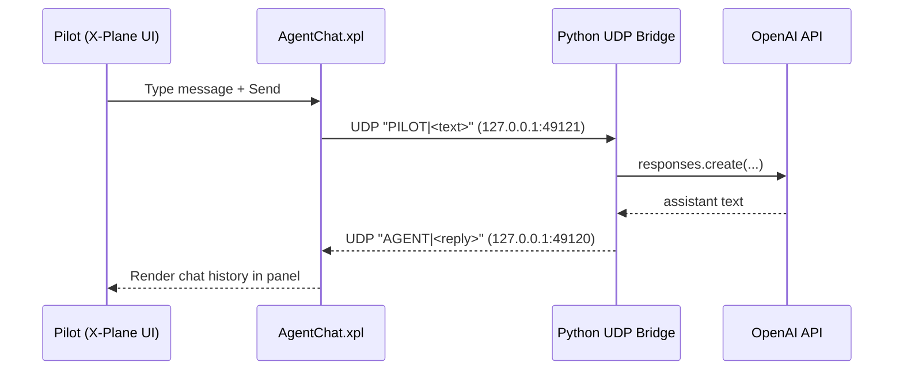

# X-Plane 11 Pilot-Agent Chat Plugin

本目录实现“飞行员在 X-Plane 内与 Agent 聊天”的专用闭环：

- `src/AgentChatPlugin.cpp`：X-Plane 原生插件（窗口、输入框、聊天记录渲染、UDP 通信）
- `bridge_agent_chat.py`：本地 Python Bridge（收飞行员消息，调用 LLM，回发给插件）

## Architecture



## 1. Build Plugin (Windows)

前置条件：

- 已安装 CMake 与支持 X-Plane 插件构建的 C++ 编译器（Visual Studio Build Tools）
- 使用当前仓库自带 SDK 头文件：`.xpc_ref/xpcPlugin/SDK/CHeaders`

```powershell
cd xplane_agent_chat_plugin
cmake -S . -B build -G "Visual Studio 17 2022" -A x64
cmake --build build --config Release
```

构建产物（默认）：

- `xplane_agent_chat_plugin/build_output/AgentChat/64/win.xpl`

## 2. Deploy to X-Plane 11

将以下目录复制到：

- `<XPlane11>/Resources/plugins/AgentChat/64/win.xpl`

可按如下结构放置：

```text
AgentChat/
  64/
    win.xpl
```

加载后可在 X-Plane Plugins 菜单看到 `Agent Chat`。

## 3. Run Python Bridge

```powershell
cd xplane_agent_chat_plugin
$env:OPENAI_API_KEY="<YOUR_KEY>"
python bridge_agent_chat.py --model gpt-4o-mini
```

默认端口：

- 插件监听回复：`127.0.0.1:49120`
- Bridge 监听飞行员消息：`127.0.0.1:49121`

## 4. Test (Bridge helper tests)

```powershell
cd xplane_agent_chat_plugin
python -m unittest -v test_bridge_agent_chat.py
```

## Security / Safety Notes

- UDP 仅绑定 `127.0.0.1`，默认不对外网开放。
- 文本会做长度限制与控制字符清洗，避免 UI 注入/渲染异常。
- LLM 不可用时会返回明确的系统提示，不会阻塞插件 UI。
