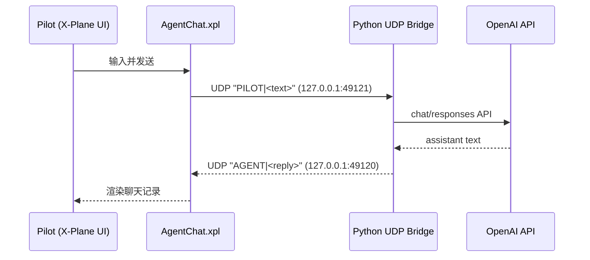

# X-Plane 11 Pilot-Agent Chat Plugin

该目录提供 X-Plane 内聊天插件与 Python 桥接程序：
- `src/AgentChatPlugin.cpp`：X-Plane 插件（窗口、输入、聊天记录渲染、UDP 通讯）
- `bridge_agent_chat.py`：本地 Python Bridge（收消息 -> 调 LLM -> 回插件）

## 架构



## 构建插件（Windows）

前置条件：
- CMake
- Visual Studio Build Tools（支持 X-Plane 插件构建）
- SDK 头文件（仓库已包含：`.xpc_ref/xpcPlugin/SDK/CHeaders`）

```powershell
cd xplane_agent_chat_plugin
cmake -S . -B build -G "Visual Studio 17 2022" -A x64
cmake --build build --config Release
```

输出：
- `xplane_agent_chat_plugin/build_output/AgentChat/64/win.xpl`

## 部署到 X-Plane 11

将产物复制到：
- `<XPlane11>/Resources/plugins/AgentChat/64/win.xpl`

目录示例：

```text
AgentChat/
  64/
    win.xpl
```

## 运行 Bridge

```powershell
cd xplane_agent_chat_plugin
$env:OPENAI_API_KEY="<YOUR_KEY>"
python bridge_agent_chat.py --model gpt-4o-mini
```

默认端口：
- 插件监听回复：`127.0.0.1:49120`
- Bridge 监听飞行员输入：`127.0.0.1:49121`

## 测试

```powershell
cd xplane_agent_chat_plugin
python -m unittest -v test_bridge_agent_chat.py
```

## 安全说明

- 默认仅使用本机回环地址（`127.0.0.1`）
- 文本进行长度与字符清洗
- API 异常时返回明确错误，不阻塞插件 UI
